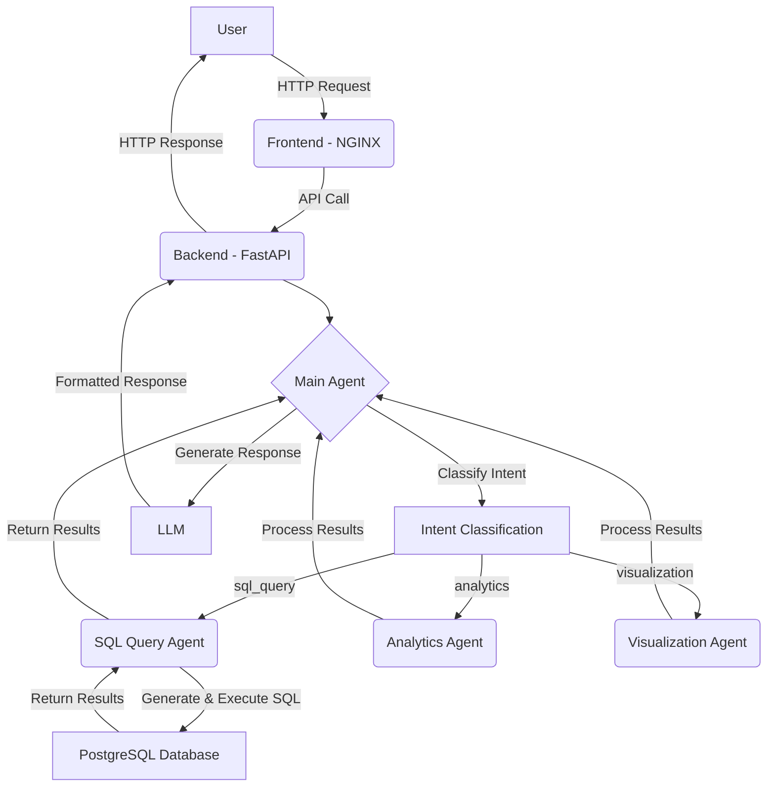

# Application Architecture

This document outlines the architecture of the Power BI Query Assistant application.

## Request Flow

The following diagram illustrates the flow of a user request through the application:

## Data Loading

The application loads data into the PostgreSQL database from a CSV file when the backend service starts. This is handled by the `entrypoint.sh` script, which executes the `load-data.sql` script.

### Best Practices for Data Loading in Docker

1.  **Use `COPY` from within the container:** The most efficient way to load data into PostgreSQL from a file is to use the `COPY` command. This command is executed by the PostgreSQL server process, so the file must be accessible from within the container.
2.  **Mount data as a volume:** The data file should be mounted into the container as a volume. This allows the data to be managed outside of the container and updated without rebuilding the image.
3.  **Use a dedicated data loading script:** A dedicated script should be used to load the data. This script can be executed as part of the container's entrypoint or as a separate command.
4.  **Use `pg_isready` to check for database availability:** Before attempting to load data, the application should check if the database is ready to accept connections. This can be done using the `pg_isready` command.
5.  **Use `\copy` for client-side loading:** If the data file is not accessible from the container, the `\copy` command can be used to load the data from the client side. This is less efficient than using `COPY` from within the container, but it can be a useful alternative in some cases.